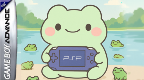

# FrogGBA - TempGBA mod by Prosty

## Download & Installation

**→ [Download the latest release here](https://github.com/tzubertowski/FrogGBA/releases) ←**

You need to have a CFW installed on your PSP. 
- Unzip the folder
- Copy the unzipped PSP folder into root of your PSP SD card
- Launch the emulator on the console

### TL;DR - Key Improvements
• 🚀 **Better Performance** - Up to 100% speed on standard PSP
• 📋 **Better Compatibility** 
• 🎨 **Color Correction** - GPSP/Retro modes with optimized lookup tables
• ⚡ **Fast Forward** - SELECT + R for 2x/3x speed
• 🖼️ **Custom Overlays** - Bezels and borders with online generator
• 📐 **Aspect Ratio Options** - Core/Zoom/Stretch modes
• 💾 **Improved Save States** - Auto-exit menu & better memory management

## About
This is a modified version of TempGBA - a Game Boy Advance emulator for PlayStation Portable.

This mod is based on:
- [TempGBA](https://github.com/Nebuleon/TempGBA) by Nebuleon, Normmatt, and BassAceGold
- TempGBA4PSP-mod (TempGBA4PSP-26731020), http://www1.axfc.net/uploader/so/3063963

## What's New in FrogGBA (Since v1.0)

### 🖼️ Overlay System
- **Custom Overlays/Borders**: Render PNG overlays above the game window for bezels, borders, and custom frames
- **X/Y Offset Controls**: Position the game window anywhere on screen
- **Online Overlay Generator**: Convert PNG images to OVL format at [froggba.onrender.com](https://froggba.onrender.com)
- **Multiple Overlay Slots**: Store up to 10 different overlays and switch between them
- **Dynamic Memory Management**: Overlays only use memory when loaded

### 📐 Display Options
- **Aspect Ratio Modes**:
  - **Core Provided (3:2)**: Original GBA aspect ratio with proper scaling
  - **Zoom (Fill Screen)**: Fills screen vertically, crops sides slightly
  - **Stretch (Full PSP)**: Stretches to fill entire 480×272 screen
- **Color Correction**: 
  - GPSP mode with optimized lookup tables
  - Retro mode for authentic GBA colors
  - Off for raw output
- **FPS Display**: SELECT + Square to toggle performance counter

### ⚡ Performance Optimizations
- **Volatile Memory Support**: Uses additional 4MB of PSP RAM for 100% speed on demanding games
  - Metroid Zero Mission: 45 FPS → 60 FPS (100% speed achieved!)
  - Works on all PSP models (1000/2000/3000/Go)
- **Partial Flush for MIPS32**: Optimized cache invalidation for better performance
- **Color Correction via LUTs**: 10x faster than real-time calculation
- **Memory Waitstate Optimization**: ~50% reduced memory access delays
- **Sprite Rendering Pipeline**: Unrolled loops and early culling for sprite-heavy games
- **Block Coalescing**: Better instruction cache usage

### 💾 Save State Improvements
- **Auto Menu Exit**: Menu automatically closes after loading/saving states
- **Better Memory Management**: Temporarily frees overlay memory during save/load operations
- **File Validation**: Prevents crashes from corrupted or empty save states
- **Persistent Settings**: All new options are saved in config

### 🎮 Quality of Life
- **Fast Forward**: SELECT + R toggles 2x/3x speed modes
- **Turbo Buttons**: Triangle and Square as dedicated turbo buttons
- **ROM Validation**: Prevents crashes when loading invalid files
- **Improved Error Messages**: Clear feedback for file and memory issues

### 🔧 Technical Improvements
- **PSP Cycle Batching**: Reduces dynamic recompiler overhead
- **Cache Invalidation Reduction**: Conservative cache management
- **Timer Prescaling Optimization**: Better audio/video sync
- **Smart Memory Allocation**: Dynamic allocation reduces static memory usage by ~550KB

### 📈 Performance Impact
- **Metroid Zero Mission**: 45 FPS → 60 FPS (33% improvement, now 100% speed!)
- **Sprite-heavy games**: 20-30% performance boost
- **General gameplay**: Consistent 60 FPS on most games with volatile memory enabled

## 🎨 How to Use Custom Overlays

### Creating Overlays
1. **Visit the Online Generator**: Go to [froggba.render.com](https://froggba.render.com)
2. **Upload Your PNG**: 
   - Image must be exactly 480×272 pixels (PSP screen size)
   - Transparent areas will show the game
   - Opaque areas will be the border/bezel
3. **Download OVL File**: Click convert and download the generated .ovl file
4. **Install on PSP**:
   - Copy the .ovl file to `/PSP/GAME/FrogGBA/overlays/` on your Memory Stick
   - Files will appear in the Overlay menu in-game

### Using Overlays in FrogGBA
1. Press **HOME** during gameplay to open the menu
2. Navigate to **Overlay Settings**
3. Select your overlay from the list
4. Adjust X/Y offset if needed to position the game window
5. Enable/disable overlays with the toggle option

### Tips for Best Results
- Design overlays with a transparent center area for the game (240×160 minimum)
- Use PNG transparency for see-through areas
- Keep border designs simple to avoid hitting the 30,000 pixel limit
- Test different aspect ratios with your overlays (Core/Zoom/Stretch)

## Original TempGBA Features

- Added gpsp kai's cheats function
- Added Chinese language support  
- Added restore function
- New menu icon
- Imported code from TempGBA-mod-dstwo-26750220
- Modern PSP SDK compatibility
- Docker-based build system
